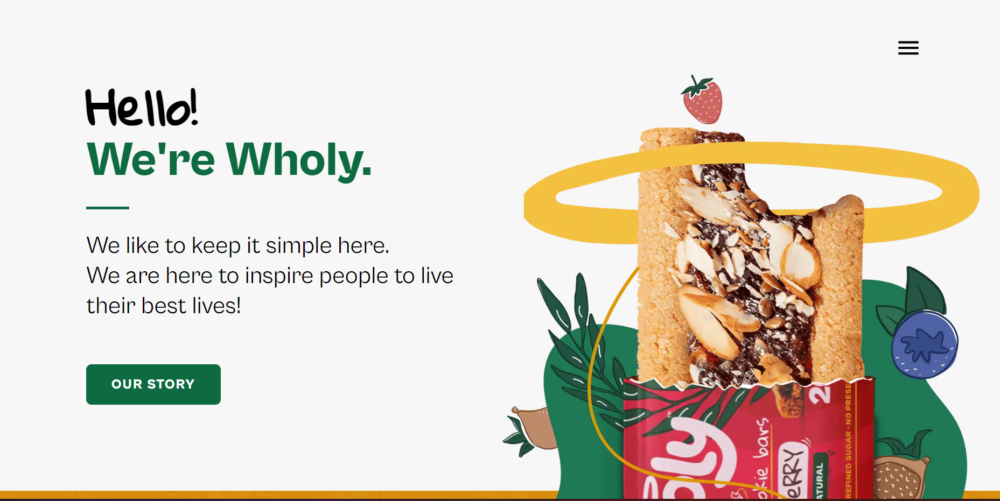
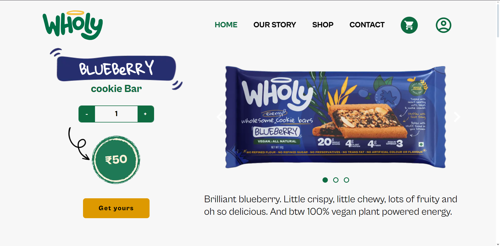
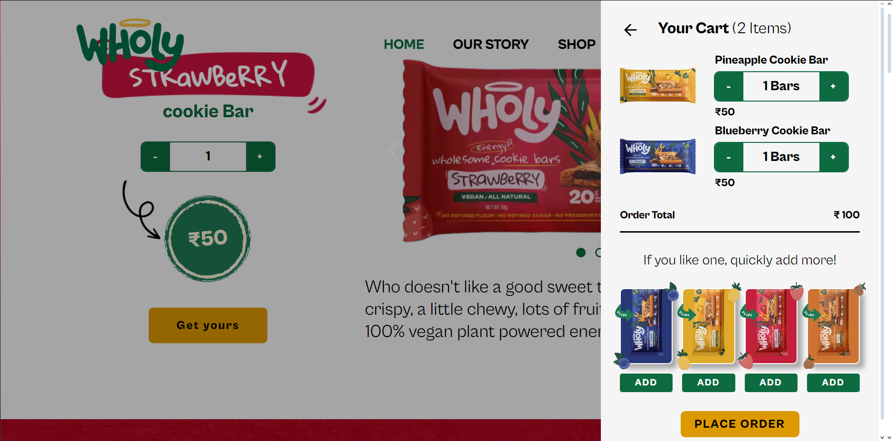
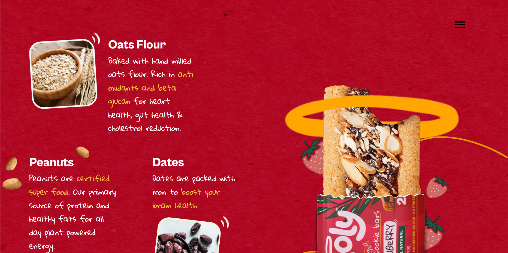

# EatWholy eCommerce Website


<div>
    <p>Preview website using a live url</p>
    <a href="https://wholy-website.vercel.app">
        https://wholy-website.vercel.app
    </a>
</div>

## Table of Contents
- [Introduction](#introduction)
- [Features](#features)
- [Technology Stack](#technology-stack)
- [Installation](installation)
- [Screenshots](screenshots)

## Introduction
Welcome to Eat Wholy, the home of handcrafted cookies infused with the irresistible flavors of blueberry, pineapple, strawberry, and fig. Our cookies are baked fresh with the finest ingredients to deliver a delightful balance of natural fruit sweetness and rich, satisfying taste. style=
Whether you're a fan of bold berry notes or tropical vibes, our unique cookies are the perfect treat for any occasion. Enjoy the convenience of ordering online and having these delicious fruit-filled cookies delivered right to your door!

## Technology Stack
- Website built using NextJS, Typescript and SCSS for the frontend.
- Admin Dashboard and Backend built using NodeJS and MedusaJS.
- Integrated Authentication using Firebase Authentication.
- Stripe was used as the Payment Processor.

## Features
- Cart functionality without the need to be signed in.
- Authentication via Firebase Authentication.
- Various Payment Options through Stripe.
- Ordering functionality with tracking using Shiprocket.
- Admin Dashboard through Medusa JS.

## Screenshots









## Installation
Open your preferred terminal and clone the project to your device using

```sh
git clone https://github.com/YaminNather/wholy-website.git
```

Navigate into the project using
```sh
cd "<project_directory>"
```

Copy the .env.local.template file 
```sh
cp "./.env.local.template" ".env.local"
```

Set the required environment variables needed to interact with the other services.

If you want to start the website in Development mode, run 

```sh
npm run dev
```

If you want ot start the website in Production mode, first build the project and then start the server using
```sh
npm run build
npm run start
```